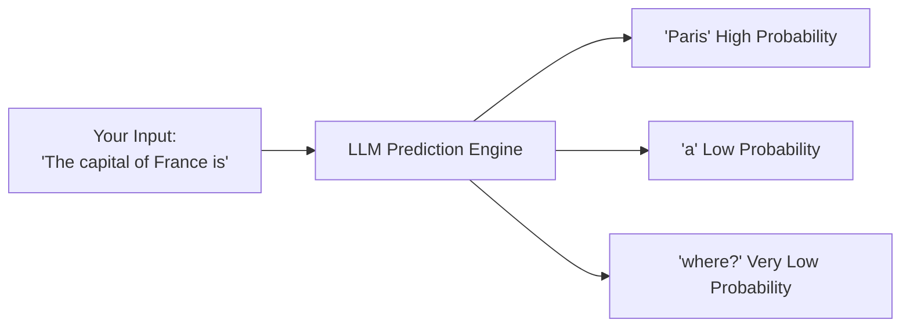

# 1. What Are Large Language Models?

Welcome to the starting point of our journey. Before we dive into technical details, let's build a strong foundational intuition. What are these "LLMs" everyone is talking about?

At its core, a **Large Language Model (LLM)** is a highly sophisticated **prediction engine**. Its primary function is to answer one question: **"Given a sequence of words (or tokens), what is the most likely next thing to say?"**

## 🤔 The Core Intuition: An Ultra-Powerful Autocomplete

If you've ever used the autocomplete feature on your phone, you already understand the basic premise of an LLM. You type "Have a..." and it suggests "great," "nice," or "good" day.

An LLM is like that, but trained on a significant portion of the entire internet. It has seen so many patterns, contexts, and nuances of human language that its predictions are not just about the next word, but about crafting coherent, contextually relevant, and often insightful paragraphs, stories, code, and more.



## 🧠 How Do They "Learn"? It's All About Patterns

LLMs are not databases of facts. They are **statistical models of language**.

*   **Training:** They are trained on terabytes of text data (books, articles, code, websites). During this process, the model learns intricate patterns, relationships between words, grammar rules, reasoning structures, and even cultural nuances.
*   **Parameters:** The "knowledge" of the model is stored in its **parameters**—often billions or trillions of them. You can think of these as tiny knobs and dials that get adjusted during training to capture the probabilities of which words follow others in various contexts.
*   **Generation:** When you give it a prompt, the model uses all these learned patterns to calculate a probability distribution over its entire vocabulary for the next token. It then selects one (often with a bit of randomness for creativity), adds it to the sequence, and repeats the process.

## 🔑 Why Are They So Powerful? The "Large" Factor

Three key factors transform a simple language model into a revolutionary "LLM":

1.  **Scale (Size):** Billions of parameters allow them to capture an astonishing depth and breadth of knowledge and linguistic subtlety.
2.  **Architecture (The Transformer):** A breakthrough neural network architecture introduced in the 2017 paper "[Attention Is All You Need](../05-paper-summaries/attention-is-all-you-need.md)". This is the secret sauce that allows models to understand context over long distances in text. We'll dive deep into this in the next section.
3.  **Training Data (Volume & Diversity):** Trained on massive, diverse datasets, enabling them to perform well on a wide range of tasks without being specifically trained for them.

## 🧪 See It in Action: A Software Engineer's Analogy

Think of an LLM like a function:

```python
def predict_next_token(sequence_of_tokens: List[Token]) -> ProbabilityDistribution:
    # 1. The model converts tokens into numerical vectors (embeddings).
    # 2. It processes these vectors through dozens of layers of neural networks (Transformers).
    # 3. It calculates probabilities for every possible next token in its vocabulary.
    # 4. It returns a probability distribution.
    return probability_distribution

# We call this function repeatedly in a loop to generate text.
output = ["The", "quick"]
for i in range(10):
    next_token = predict_next_token(output)
    output.append(select_token(next_token)) # e.g., adds "brown", then "fox", etc.

print(" ".join(output))
# Output: "The quick brown fox jumps over the lazy dog"
```

## 📝 Key Takeaways

*   **LLMs are prediction machines.** Their core task is predicting the next most likely token in a sequence.
*   **They learn from data.** Their "intelligence" is a reflection of the patterns found in their massive training datasets.
*   **Scale is key.** The "Large" in LLM refers to the huge number of parameters, the massive dataset, and the powerful architecture that enables complex reasoning.
*   **They are not truth engines.** They generate plausible text based on patterns, which can sometimes lead to confident but incorrect statements (called "hallucinations").

---

**Next Up:** ➡️ **[NLP Basics: Tokenization, Embeddings, and Attention](./02-nlp-basics.md)**
> To understand how this prediction is actually implemented, we need to learn about the fundamental building blocks: how words become numbers, and how models understand their relationships.
