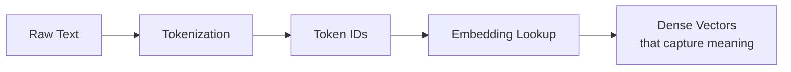

# 2. NLP Basics: The Pillars of LLMs

Now that we understand the "what," let's explore the "how." How do we take human language and make it something a computer can understand and process? This is where three fundamental concepts come into play: **Tokenization**, **Embeddings**, and **Attention**. These are the true pillars that every LLM is built upon.

## 1. 🪙 Tokenization: Breaking Text into Pieces

Computers don't understand words; they understand numbers. Tokenization is the process of converting raw text into a sequence of numbers (called tokens) that the model can process.

*   **What is a token?** It can be a word, a part of a word (subword), or even a single character. For example, the word "unhappiness" might be split into tokens like `["un", "happiness"]`.
*   **Why subwords?** This approach allows the model to handle a vast vocabulary and unknown words by breaking them into known pieces. It's a balance between character-level (too granular) and word-level (too many unique tokens) processing.
*   **The Tokenizer:** A separate algorithm that handles this splitting. Different models (GPT, BERT) use different tokenizers.

**Example:**
```text
Text:    "Let's explore tokenization!"
Tokens:  ["Let", "'", "s", " explore", " token", "ization", "!"]
IDs:     [2314, 8, 45, 1092, 6432, 1245, 7]
```

## 2. 🔢 Embeddings: From Numbers to Meaning

Token IDs are arbitrary; the number `2314` for "Let" has no mathematical relationship to `45` for "s". Embeddings solve this by mapping each token ID to a high-dimensional vector (a list of numbers) that *represents its meaning*.

*   **What is an embedding?** A dense vector of numbers (e.g., 768 or 1024 numbers long) where each dimension represents some latent feature of the word's meaning (e.g., gender, plurality, sentiment, topic).
*   **The Magic:** Words with similar meanings have similar vectors. The model learns these relationships during training.
*   **Analogy:** Think of it as a vast, multi-dimensional map. Words like "king," "queen," "man," and "woman" are all clustered together in a "royalty" or "gender" region of this map. This allows the model to perform analogies like **king - man + woman = queen** mathematically.



## 3. ✨ Attention: The Revolution

This is the most important concept. The **Attention Mechanism** allows a model to focus on different parts of the input sequence when generating each output token.

*   **The Problem it Solves:** Before attention, models (like older RNNs) struggled with long-range dependencies. For example, to translate "The cat, which spent all afternoon chasing the mouse around the living room, was tired," the model needs to connect "cat" to "was tired" at the very end.
*   **How it Works:** For every token it processes, the model calculates a "attention score" with every other token in the sequence. It uses these scores to create a weighted sum of the context that is most relevant to the current token.
*   **Self-Attention:** A specific type where the model relates all positions in a single sequence to compute a new representation of the same sequence. This is the "self" in "self-attention."

**Simple Analogy:** When you read this sentence, you don't give equal weight to every word. Your brain *attends* to key words like "cat" and "tired" to understand the meaning. The attention mechanism gives LLMs this same ability.

## 🧠 Putting It All Together: The High-Level Flow

1.  **Input:** `"The capital of France is"`
2.  **Tokenization:** `["The", " capital", " of", " France", " is"]` -> `[5, 234, 12, 987, 7]`
3.  **Embedding Lookup:** Each ID becomes a vector of 512 numbers, representing its meaning.
4.  **Attention Processing:** The vector for `"is"` pays strong attention to `"France"` and weak attention to `"The"`.
5.  **Prediction:** The processed vectors are used to predict the next most likely token: `"Paris"`.

---

**Next Up:** ➡️ **[LLM Architectures: GPT, BERT, and T5](./03-llm-architectures.md)**
> Now that we know the basic components, let's see how they are arranged into different model architectures, each with unique strengths.