# 14. Prompt Refinement: The Iterative Process

Creating an effective prompt is rarely a one-shot process. **Prompt refinement** is the systematic approach to iteratively improving your prompts to get more accurate, reliable, and useful outputs from LLMs.

Think of it like tuning a musical instrument - small adjustments can make a huge difference in the quality of the output.

## 🎯 Why Refine Prompts?

- **Improve Accuracy:** Get more factually correct and relevant responses
- **Increase Reliability:** Reduce variability in outputs for the same input
- **Control Style/Tone:** Ensure the output matches your desired voice and format
- **Reduce Hallucinations:** Minimize made-up or irrelevant content
- **Optimize Cost:** Get better results with fewer tokens (shorter prompts)

## 🔁 The Prompt Refinement Cycle

Follow this iterative process to systematically improve your prompts:

```mermaid
flowchart TD
    A[Write Initial Prompt] --> B[Test with Sample Inputs]
    B --> C{Analyze Results}
    C -->|Good enough?| D[✅ Done]
    C -->|Needs improvement| E[Identify Failure Patterns]
    E --> F[Make Specific Adjustments]
    F --> B
```



## 🧰 Refinement Techniques & Strategies

### 1. Add Specificity and Constraints
**Problem:** Vague prompts produce vague results.
**Solution:** Add concrete constraints and specifications.

**Before:**
```
Write a product description for a new smartphone.
```

**After:**
```
Write a 150-word product description for the new "TechMaster Pro" smartphone. 
Focus on its 48-hour battery life, professional-grade camera, and durability. 
Use a persuasive but professional tone and include a call-to-action at the end.
Target audience: busy professionals who travel frequently.
```

### 2. Clarify the Role and Persona
**Problem:** Generic responses without perspective.
**Solution:** Assign a specific role to the AI.

**Before:**
```
Explain blockchain technology.
```

**After:**
```
Act as a senior software engineer explaining blockchain to a product manager
who needs to understand the technical basics for a business decision. Use one
simple analogy and avoid excessive jargon.
```

### 3. Improve Output Formatting
**Problem:** Unstructured or hard-to-parse outputs.
**Solution:** Specify the exact format you need.

**Before:**
```
List the advantages of remote work.
```

**After:**
```
List the top 5 advantages of remote work. Format the response as a JSON object
with keys "advantage" and "explanation" for each item. Only include the JSON,
no additional text.
```

### 4. Break Down Complex Tasks
**Problem:** The model overlooks parts of a multi-step request.
**Solution:** Use explicit step-by-step instructions.

**Before:**
```
Analyze this customer feedback and suggest improvements.
```

**After:**
```
Follow these steps for the customer feedback below:
1. Summarize the main points in one paragraph
2. Identify the sentiment (positive/negative/neutral)
3. Suggest three specific improvements to address the concerns
4. Rate the overall feedback urgency from 1-5

Customer feedback: "[...]"
```

### 5. Add Examples (Few-Shot Refinement)
**Problem:** The model doesn't understand your desired format or style.
**Solution:** Provide clear input-output examples.

**Before:**
```
Convert these questions to Spanish.
```

**After:**
```
Convert the following English questions to Spanish:

Example 1:
Input: "What time does the store open?"
Output: "¿A qué hora abre la tienda?"

Example 2:
Input: "Where is the nearest bathroom?"
Output: "¿Dónde está el baño más cercano?"

Now convert: "How much does this cost?"
```

## 🧪 Practical Exercise: The Feedback Email Generator

Let's refine a prompt together. Your task is to create a prompt that generates polite feedback emails.

**Step 1: Initial Attempt**
```
Write a feedback email about slow service at a restaurant.
```

Test this prompt. You'll likely get something generic.

**Step 2: First Refinement** - Add specificity and role
```
Act as a polite but disappointed customer. Write a concise email to the manager
of "Sunset Bistro" about experiencing slow service during dinner last night.
Mention that the food was good but the 45-minute wait for mains was frustrating.
```

**Step 3: Second Refinement** - Control tone and format
```
Act as a polite but disappointed customer. Write a 200-word email to the manager
of "Sunset Bistro" about slow service during Friday dinner. Use a professional
but slightly disappointed tone. Structure it with:
1. Polite opening
2. Specific issue (45-minute wait for mains)
3. Positive note about food quality
4. Constructive suggestion
5. Polite closing

Do not use angry language or make threats.
```

**Step 4: Third Refinement** - Add context constraints
```
[Context: You are Jane Doe, who dined at Sunset Bistro on March 15, 2024 at 7 PM
with a party of 4. Your server was Alex. You ordered the salmon, which was
excellent, but arrived at 8:15 PM after ordering at 7:30 PM.]

Act as a polite but disappointed customer. Using the context above, write a
200-word email to the restaurant manager. Follow the structure from previous
prompt and maintain a professional tone throughout.
```

## 📊 Tracking Your Refinements

Keep a refinement journal for important prompts:

| Version | Changes Made | Results Improvement | Token Count |
|:---:|:---|:---|:---|
| v1 | Basic prompt | Generic output | 12 tokens |
| v2 | Added role, specifics | More focused | 45 tokens |
| v3 | Added structure, constraints | Better format, tone | 78 tokens |
| v4 | Added context | Personalized, accurate | 120 tokens |

## 🚀 Pro Refinement Tips

1.  **Test with Edge Cases:** Try your prompt with unusual inputs to find weaknesses
2.  **A/B Testing:** Create multiple versions and compare results systematically
3.  **Model Comparison:** Test your prompt across different models (GPT-4, Claude, etc.)
4.  **Temperature Adjustment:** Lower temperature (0.2-0.5) for more consistent results during refinement
5.  **Iterate in Small Steps:** Make one change at a time so you know what caused improvement

## 🔍 Common Refinement Patterns

- **From:** `Do X` → **To:** `As [role], do X for [audience] using [format]`
- **From:** `List items` → **To:** `List exactly N items in [format] with [criteria]`
- **From:** `Explain concept` → **To:** `Explain concept to [audience] using [analogy] in [length]`
- **From:** `Generate content` → **To:** `Generate content with [tone] that includes [elements] and excludes [elements]`

---

**Next Step:** ➡️ **[Understanding Model Limitations](./15-model-limitations.md)**
> Now that you know how to refine prompts, learn where even the best prompts can't overcome fundamental model limitations.
